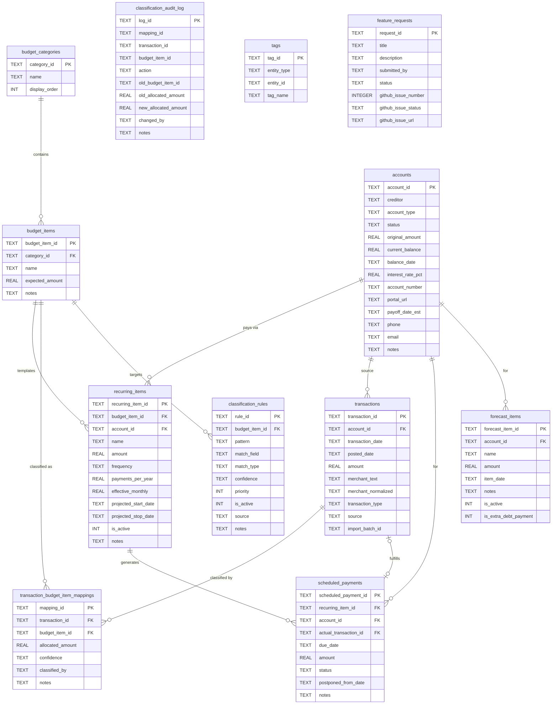
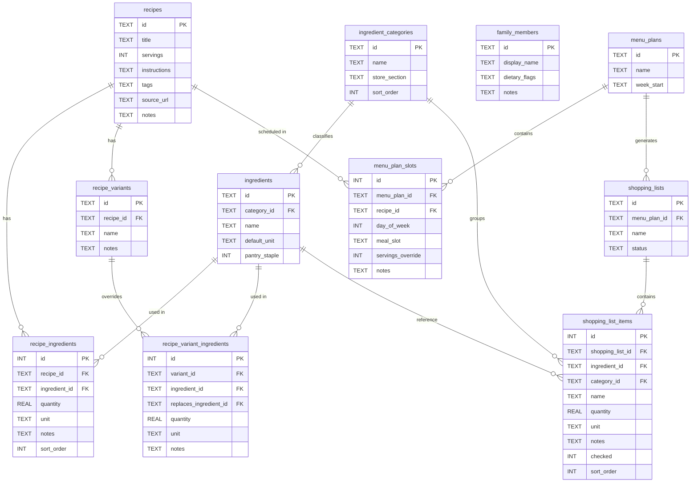

# Entity Relationship Diagrams

Generated from SQLite migration files. All dates are ISO 8601 `TEXT`; amounts are `REAL` (negative = outflow, positive = income).

## Finance

**Views**

| View | Purpose |
|---|---|
| `active_recurring_items` | Recurring items whose date range includes today |
| `monthly_outflow_by_category` | Effective monthly spend per budget category (from templates, not actuals) |
| `unmatched_transactions` | Transactions with no budget-item mapping |

---

## Food

> `meal_slot` values: `breakfast`, `lunch`, `dinner`, `snack`  
> `day_of_week`: 0 = Monday … 6 = Sunday  
> `tags` and `dietary_flags` are JSON arrays stored as TEXT
